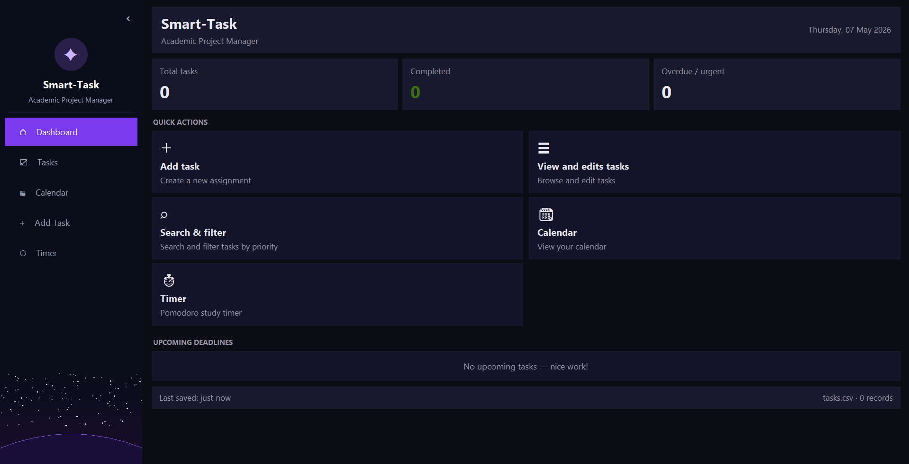
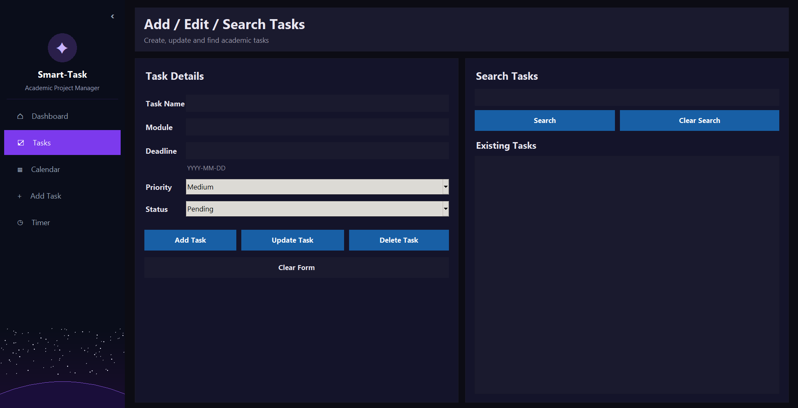
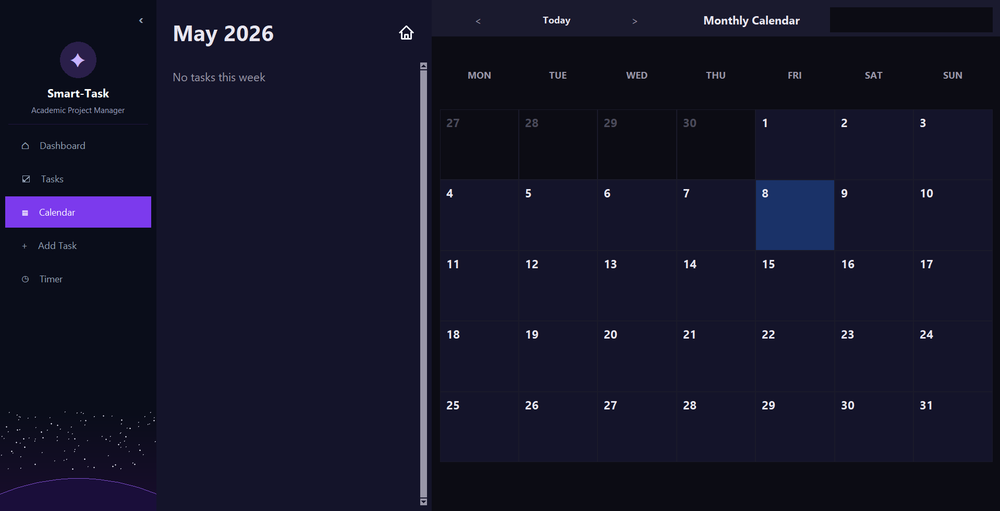
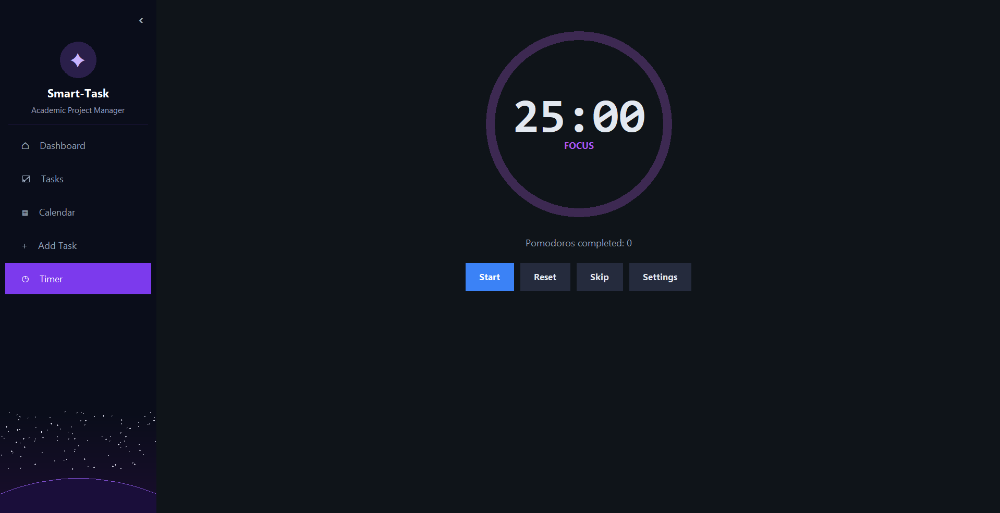

# Smart-Task Academic Project Manager

Smart-Task is a desktop task management application designed to help university students organise academic work, deadlines and study sessions.

The app allows users to add, view, edit, delete, search and filter academic tasks. It also includes a dashboard, calendar view and study timer so that students can manage their workload from one place.

## Features

### Dashboard

The dashboard acts as the main menu of the application. It provides a summary of the student’s current workload and what they have achieved, as well as quick navigation buttons to the main features of the app.

The dashboard includes:

- Total number of tasks
- Number of completed tasks
- Number of overdue or urgent tasks
- Upcoming deadlines
- Quick action buttons for:
  - Adding tasks
  - View and editing tasks
  - Search and filtering tasks
  - Calendar
  - Timer

### Task Management

The task screen allows users to create and manage academic tasks.

Users can:

- Add new tasks
- Edit existing tasks
- Delete tasks
- Search for tasks
- View saved tasks
- Store task details such as:
  - Task name
  - Module
  - Deadline
  - Priority
  - Status

### Calendar View

The calendar screen displays tasks in a monthly calendar format. It helps users see their deadlines visually and understand how their workload is spread across the month. It also includes navigation controls that allow users to browse between months, and be able to quickly return to the current date

The calendar includes:

- Monthly calendar layout
- Highlighted current day
- Search bar for tasks
- Priority colour coding:
  - High priority: red
  - Medium priority: amber
  - Low priority: green
- Weekly task summary sidebar
- Scrollable task list for the selected week
- Home icon for returning to the dashboard

### Timer

The timer screen provides a Pomodoro-style study timer to help students focus during study sessions. There is also a circular progress indicator surrounding the stopwatch, creating a more visual display of the remaining time.

The timer includes:

- Start, pause, reset and skip controls
- Settings for changing work and break durations
- Number count for sessions completed

### Data Persistence

Tasks are saved using a CSV file so that task data is not lost when the application closes. The model layer handles loading, saving, adding, updating and deleting tasks.

## Screenshots

Here are some screenshots to show how the app should look like once started.

### Dashboard



### Task Management



### Calendar



### Timer



## Technologies Used

- Python
- Tkinter
- CSV file handling
- Git
- GitHub
- Python unittest

## How To Run The Application

### Prerequisites

Make sure Python is installed on your computer.

### Run The App

From the project folder, run:

```bash
python main.py
```
This opens the Smart-Task desktop application

## Project Structure

Software-Engineering_Group-13/
    controllers/
        app_controller.py
    data/
        tasks.csv
    models/
        task_model.py
    tests/
        test_integration.py
        test_task_model.py
    views/
        calendar_view.py
        main_menu.py
        sidebar.py
        splash.py
        task_form_view.py
        timer.py
    main_menu.py
    main.py
    README.md

## Architecture

The project follows a simple Model-View-Controller structure.

### Model

The model handles task data and CSV storage. It is responsible for adding, updating, deleting, loading and saving tasks.

### View

The view layer contains the Tkinter interface screens, including the dashboard, task form, calendar, sidebar, splash screen and timer.

### Controller

The controller connects the views to the task model. It allows the user interface to interact with task data without directly accessing the CSV file.

## Testing

The project includes unit and integration tests using Python's unittest framework

To run the tests:

```bash
python -m unittest discover -s tests -p "test_*.py"
```

The tests cover:
- Adding tasks
- Updating tasks
- Deleting tasks
- Filtering tasks
- Searching tasks
- Saving and loading task data
- Controller and model integration

## Branching and Collaboration

The project was developed using GitHub branches. Each major feature was developed separately and then integrated into the final application.

The final integration was completed through the app controller so that all screens could be accessed from the main application.

## Known Limitations

- The application is designed for desktop use only.
- Task data is stored in a CSV file, which is suitable for this coursework project, but might be less suitable for a large multi-user system.
- The dashboard and calendar depend on task data being entered in the expected format.
- The user interface could be improved further with additional validation and accessibility features.

## Future Improvements

Possible future improvements include:

- More advanced task filtering
- Task reminders and notifications
- Editing tasks directly from the calendar
- Improved dashboard analytics
- Database storage instead of CSV
- More detailed module-based workload summaries

## Team Contributions

- Gabriela: Calendar view, integration support, README and app testing
- Rishith: Dashboard/main menu and task overview features
- Hashem: Add, edit, search and delete task screen
- Gérson: Sidebar, splash screen, timer and main application structure
- Team: Model, controller, testing and final integration

## Conclusion

Smart-Task provides a streamlined academic project management tool designed for university students. The application combines task creation, deadline tracking, calendar organisation, and focused study timing within a single desktop platform. The project demonstrates the use of Python GUI development, CSV-based data persistence, software testing, GitHub collaboration, and the successful integration of multiple independently developed features into a cohesive application.